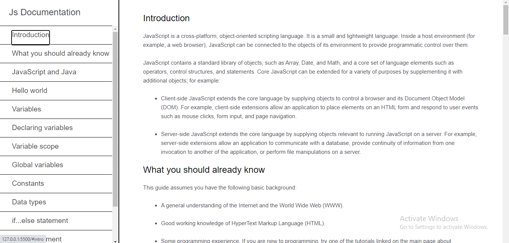
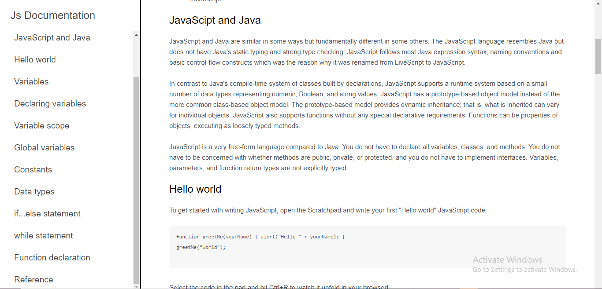

# Js-Documentation
*An implementation of Js-documentation clone with html and css*
## Prequisite
- Your browser version should be up to date for better experience
## Getting Started
Clone or download this repository and run with a local server of open `index.html` with your favorite browser
## Features
- Home page
- Introduction
- What you should already know
- JavaScript and Java
- Hello world
- Variables
- Declaring variables
- Variable scope
- Global variables
- Constants
- Data types
- if...else statement
- while statement
## Tech/framework used
- Html
- Css
## Preview here
[Demo](https://rawcdn.githack.com/Intelligence247/Js-Documentation/4ff06134f04badc82c15daed19c001ceeec04ba3/index.html)

## Contact
If you want to contact me you can reach me at
- https://github.com/Intelligence247 or
- uthmanabdullahi2020@gmail.com
## Addtional Info
- This is one of the series of project for the @CodeVillage.org 
- This is not meant for production. It's for learning purpose only
